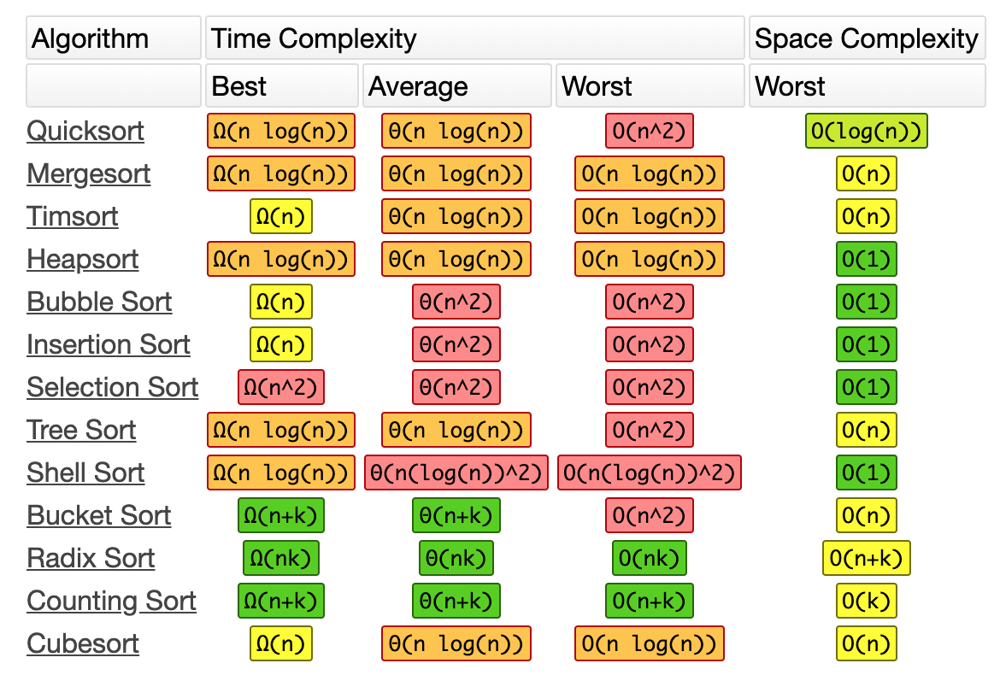

  

  <h1 align="center">Sorting cheat sheet for Data Science</h1>

  

    <a href="thienhang.com">View Demo</a>
    ·
    <a href="https://thienhang.com">Report Bug</a>
    ·
    <a href="https://thienhang.com">Request Feature</a>
  

# Introduction:

| Language/Library | Method                                  | In-place or Return a Copy | Argument to Switch Sort Order to Descending | Type of Sort                                        | Other Arguments                                               | Notes                                | Default Axis |
|------------------|-----------------------------------------|-----------------------------|-----------------------------------------------|-----------------------------------------------------|--------------------------------------------------------------|--------------------------------------|--------------|
| Python (vanilla) | `my_list.sort()`                        | In-place                    | `reverse = True`                              | timsort                                             | `key`                                                          | For lists only.                     | n/a          |
| Python (vanilla) | `my_list = sorted(my_iterable)`         | Copy                        | `reverse = True`                              | timsort                                             | `key`                                                          | For any iterable.                   | n/a          |
| Numpy            | `my_ndarray.sort()`                     | In-place                    | n/a - do outside with  `[::-1]`               | Default is quicksort. Alternative options: 'mergesort', 'heapsort', 'stable'. | `axis=-1, kind='quicksort', order=None`                         | Quicksort is introsort, which becomes heapsort if slow. Stable is mapped to mergesort. Mergesort uses timsort or radix sort under the hood, depending upon the data type. | last axis    |
| Numpy            | `np.sort(my_array)`                     | Copy                        | n/a - do outside with  `[::-1]`               | Default is quicksort. Alternative options: 'mergesort', 'heapsort', 'stable'. | `axis=-1, kind='quicksort', order=None`                         | Quicksort is introsort, which becomes heapsort if slow. Stable is mapped to mergesort. Mergesort uses timsort or radix sort under the hood, depending upon the data type. | last axis    |
| Pandas           | `df = df.sort_values(by='my_column')`   | Copy (unless inplace=True) | `ascending = False`                          | Default is numpy quicksort. Alternative options: 'mergesort', 'heapsort', 'stable'. | `by, axis=0, inplace=False, kind='quicksort', na_position='last'` | For DataFrame and Series. Uses Numpy for sorting under the hood. | last axis    |
| TensorFlow       | `tf.sort(my_values)`                    | Copy                        | `direction = 'DESCENDING'`                   | Finds the largest value in the tensor using top_k(). Uses CUB Cuda library, which wraps thrust, for parallel sort with GPU for large cases; algorithms vary - e.g. merge sort, radix sort. | -                                                            | last axis                            |
| PyTorch          | `torch.sort(my_values)`                 | Copy                        | `descending = True`                         | Uses thrust CUDA library for parallel sort with GPU for large cases; algorithms vary - e.g. merge sort, radix sort. | -                                                            | last axis                            |
| SQL              | `ORDER BY my_column`                    | Copy                        | `DESC`                                      | Varies. Postgres uses a disk merge sort, quick sort, or heap sort depending upon the situation. | -                                                            | n/a                                  |

Table 1. 

| Name          | When?                | How?                                                                | Worst  | Average | Best   | Memory Required | Stable | InPlace | Recursive | Type        | Notes                                                                                                                     |
|-------------- |----------------------|---------------------------------------------------------------------|--------|---------|--------|------------------|--------|---------|-----------|-------------|--------------------------------------------------------------------------------------------------------------------------|
| Bubble        | Never                | Swap adjacent pairs. Bubble up.                                      | n^2    | n^2     | -      | -                |        |         |           | Comparison  | Don't use                                                                                                                 |
| Insertion     | Almost never         | -                                                                   | n^2    | n^2     | n^2    | -                | Yes    |         |           | Comparison  | Insertion Sort - good on nearly sorted collections, low overhead, stable. Used as a base case for quicksort.              |
| Selection     | Almost never         | -                                                                   | n^2    | -       | -      | -                | Yes    |         |           | Comparison  | Selection Sort - performs poorly, fewer swaps than Insertion Sort.                                                          |
| Heap          | When concerned about worst case | nlogn version of selection sort. Leverages a heap data structure. | n(log n)| n(log n)| n(log n)| -               | Yes    | No      | Binary    | Comparison  | Many consider it the best sorting algorithm for guaranteed O(n log n) time complexity.                                  |
| Merge         | When need stable      | Zip, comparison-based, stable, divide and conquer algorithm.       | n(log n)| n(log n)| n(log n)| -               | Yes    |         |           | Comparison  | The only guaranteed O(n log n) even in the worst case. Uses more memory.                                                    |
| Quick         | For speed             | Merge with a pivot. Linear time O(n) and in-place.                  | n^2    | n(log n)| n(log n)| -               | Can be | Yes     | Mergesort with a pivot | Comparison  | Often faster than other O(n log n) algorithms in practice. Slower on already sorted data.                                |
| Tim           | Python default        | Stable, adaptive, hybrid sorting algorithm derived from Merge sort and Insertion sort. | n(log n)| n(log n)| n      | -               | Yes    |         |           | Comparison  | Takes advantage of partial orderings in real-world data. Hybrid algorithm.                                                 |
| Shell         | -                    | Improves on insertion sort by sorting incremental sublists.         | -      | -       | -      | -               |        |         |           | -           | Falls between O(n) and O(n^2).                                                                                             |
| Intro         | -                    | Combo                                                               | -      | -       | -      | -               |        |         |           | -           | -                                                                                                                          |

Table 2. 

# References:

Sorting cheat sheet for data science. (2020, June 16). Prog.World. <https://prog.world/sorting-cheat-sheet-for-data-science/>
